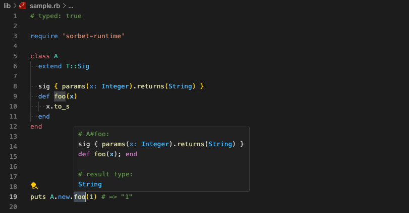

# Minimal Sorbet Sample

This is a minimal sample to verify the behavior of Sorbet. It can also be used as a template to present a reproduction environment when a bug is found.
Of course, the [Sorbet Playground](https://sorbet.run/) is also useful.

- `bundle`
- `bundle exec srb tc`
- `ruby lib/sample.rb`

